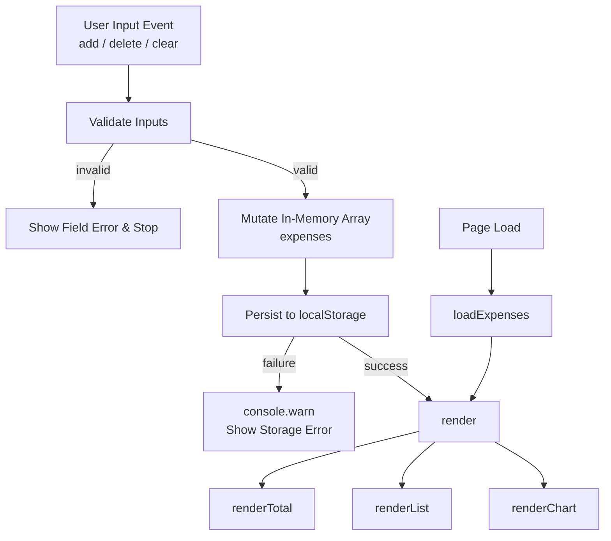

# Design Document — Expense & Budget Visualizer

## Overview

The Expense & Budget Visualizer is a single-page web application (SPA) built with plain HTML, CSS, and vanilla JavaScript. It lets users record personal expense transactions (name, amount, category), view a running total, browse a scrollable history, delete individual or all entries, and see a doughnut chart that breaks down spending by category. All data is persisted in `localStorage` so it survives page refreshes. There is no server, no build step, and no JavaScript framework.

**Technology stack:**
- HTML5 (semantic markup)
- CSS3 (single file: `css/style.css`, custom properties, responsive media queries)
- Vanilla JavaScript ES2020 (single file: `js/script.js`, modules-free)
- [Chart.js 4.4.0](https://www.chartjs.org/) (loaded from jsDelivr CDN) for the doughnut chart
- Browser `localStorage` for persistence

**Constraints imposed by requirements:**
- No CSS or JS framework.
- All styles in one file (`css/style.css`), all logic in one file (`js/script.js`).
- Maximum content width 520 px, centred on wide viewports.
- Minimum font size 14 px; minimum tap target 44×44 px on viewports ≤ 400 px.
- User-supplied text must be inserted via DOM-safe methods (no `innerHTML` for user data).

---

## Architecture

The application follows a simple **data → render** cycle with no virtual DOM or reactive framework. Every mutation to the transaction list triggers a full re-render of the three dependent UI regions (total, list, chart). Because the dataset is expected to be small (personal use, single browser), this approach has negligible performance impact.



### Module boundaries (within `js/script.js`)

Everything lives in one file, logically divided into four named concerns that map directly to the functions defined in the source:

| Concern | Functions |
|---|---|
| Input reading & validation | inline logic inside `addExpense()` |
| Transaction mutation | `addExpense()`, `deleteExpense(id)`, `clearAllBtn` click handler |
| Storage access | `loadExpenses()`, `saveExpenses()` |
| Rendering | `render()`, `renderTotal()`, `renderList()`, `renderChart()` |

---

## Components and Interfaces

### 1. App Shell (`index.html`)

Semantic sections in document order:

```
<header class="app-header">        — app title "💰 Budget Visualizer" and subtitle
<section class="balance-card">     — Total_Display (#totalBalance)
<section class="card form-card">   — Expense Input Form
<section class="card chart-card">  — Doughnut Chart (#pieChart) + #noDataMsg
<section class="card list-card">   — List header with #clearAllBtn + <ul#transactionList> + #emptyMsg
```

### 2. Expense Input Form

| Element | Type | Constraints |
|---|---|---|
| `#itemName` | `<input type="text">` | `autocomplete="off"`, trimmed before validation |
| `#amount` | `<input type="number">` | `min="0"`, trimmed before validation |
| `#category` | `<select>` | Options: Food, Transport, Fun |
| `#addBtn` | `<button>` | Triggers `addExpense()` on click |
| `#errorMsg` | `<p class="error-msg">` | Single shared field-level error display |

**Enter key** on `#itemName` or `#amount` also calls `addExpense()` via `keydown` event listener.

### 3. Validation Layer

Validation logic lives inline inside `addExpense()`. Two sequential checks are performed before any transaction is created:

1. **Name check** — `name = itemNameEl.value.trim()`. If `!name`, calls `showError('Please enter an item name.')`, focuses `#itemName`, and returns early.
2. **Amount check** — `rawAmt = amountEl.value.trim()`. If `!rawAmt || isNaN(rawAmt) || Number(rawAmt) <= 0`, calls `showError('Please enter a valid amount greater than 0.')`, focuses `#amount`, and returns early.

> **Requirement deviation — Req 2.3**: The requirement specifies rejection of amounts > 999,999,999.99, but the current implementation only rejects `<= 0`. There is no upper-bound validation in the code. This is a known gap.

On valid input: calls `clearError()` which sets `errorMsg.textContent = ''`, then proceeds to create the transaction.

### 4. Transaction Mutation

**`addExpense()`** — reads `#itemName`, `#amount`, `#category`, validates (see §3), builds a `Transaction` object, calls `expenses.unshift(expense)` to prepend, calls `saveExpenses()`, calls `render()`, resets form fields (`itemNameEl.value = ''`, `amountEl.value = ''`), returns focus to `#itemName`.

**`deleteExpense(id)`** — filters `expenses` via `expenses = expenses.filter(e => e.id !== id)`, calls `saveExpenses()`, calls `render()`. Note: there is no rollback on storage failure in the current implementation.

**`clearAllBtn` click handler** — no-ops when `expenses.length === 0`. Shows `confirm('Delete all expenses? This cannot be undone.')`.

> **Requirement deviation — Req 6.2**: The requirement specifies the confirmation dialog must show the number of transactions to be deleted. The current implementation uses the native `confirm()` API with a fixed string that does not include a count.

On confirm: sets `expenses = []`, calls `saveExpenses()`, calls `render()`.  
On cancel (user clicks Cancel): no changes made.

### 5. Storage Layer

**`saveExpenses()`** — wraps `localStorage.setItem(STORAGE_KEY, JSON.stringify(expenses))` in `try/catch`. On failure: logs `console.warn('LocalStorage write failed:', e)`. Does not throw or revert.

**`loadExpenses()`** — wraps `localStorage.getItem(STORAGE_KEY)` and `JSON.parse()` in `try/catch`. Returns the parsed array if `raw` is truthy; on any failure logs `console.warn('LocalStorage read failed:', e)` and returns `[]`.

> **Requirement deviation — Req 9.1**: The requirement specifies the localStorage key must be `"transactions"`. The implementation uses `STORAGE_KEY = 'budget_expenses'`. This is a known deviation; the stored data key does not match the requirement specification.

> **Requirement deviation — Req 9.3**: `loadExpenses()` does not explicitly check `Array.isArray()` on the parsed value. If `localStorage` contains valid JSON that is not an array (e.g., `null`, an object, a number), the app will initialise with that value and may fail silently rather than falling back to `[]`.

### 6. Render Layer

**`render()`** — calls `renderTotal()`, `renderList()`, `renderChart()` in sequence. Called on init, after add, after delete, and after clear-all.

**`renderTotal()`** — sums `expenses[].amount` with `reduce`, formats via `'Rp ' + amount.toLocaleString('id-ID')`, writes result to `totalBalanceEl.textContent`.

**`renderList()`** — sets `transactionList.innerHTML = ''`. If `expenses.length === 0`, sets `emptyMsg.style.display = 'block'` and returns. Otherwise sets `emptyMsg.style.display = 'none'`, then for each expense builds a `<li class="transaction-item">` via `document.createElement('li')`. User-supplied `name` is inserted via `escapeHTML(e.name)` inside `innerHTML` (HTML-escaped, not raw DOM text nodes). Sets `li.dataset.category = e.category` for CSS border coloring. Attaches `.tx-delete` click handler bound to `deleteExpense(e.id)`. Appends to `transactionList`.

**`renderChart()`** — aggregates amounts per category into `totals = { Food: 0, Transport: 0, Fun: 0 }`. Filters to categories with `totals[c] > 0`. Sets `noDataMsg.style.display`. If a `pieChart` instance already exists: updates `pieChart.data` in place and calls `pieChart.update()`. Otherwise creates a new `Chart` instance (type `'doughnut'`) on `#pieChart` canvas with `cutout: '60%'`, custom tooltip callback.

### 7. Category Metadata Registry

A single `CATEGORY_META` object is the single source of truth for all per-category data. Adding a new category requires editing only this object plus the `<select>` options in HTML:

```js
const CATEGORY_META = {
  Food:      { icon: '🍔', color: '#ff6384' },
  Transport: { icon: '🚌', color: '#36a2eb' },
  Fun:       { icon: '🎮', color: '#ffce56' },
};
```

When a transaction's category is not found in `CATEGORY_META`, `renderList()` falls back to `{ icon: '💸', color: '#aaa' }`.

### 8. Utility Functions

| Function | Purpose |
|---|---|
| `formatCurrency(amount)` | Returns `'Rp ' + amount.toLocaleString('id-ID')` |
| `escapeHTML(str)` | Replaces `& < > " '` with HTML entities to prevent XSS |
| `showError(msg)` | Sets `errorMsg.textContent = msg` |
| `clearError()` | Sets `errorMsg.textContent = ''` |

---

## Data Models

### Transaction Object

```ts
interface Transaction {
  id:       number;          // Date.now() at creation time — unique per session
  name:     string;          // Trimmed, non-whitespace input from #itemName
  amount:   number;          // parseFloat(Number(rawAmt).toFixed(2)) — 2 decimal places
  category: 'Food' | 'Transport' | 'Fun';
  date:     string;          // new Date().toLocaleDateString('id-ID', { day:'2-digit', month:'short', year:'numeric' })
                             // e.g. "14 Sep 2025"
}
```

### In-Memory State

```ts
const STORAGE_KEY = 'budget_expenses';  // NOTE: requirement specifies "transactions" — see deviations above
let expenses: Transaction[] = [];        // newest-first; mutated by addExpense/deleteExpense/clearAll
let pieChart: Chart | null = null;       // singleton Chart.js instance; created once, updated in place
```

### Storage Schema

```
localStorage key: "budget_expenses"   (implementation)  /  "transactions"  (requirement — deviation)
value: JSON array of Transaction objects, newest-first; absent or null for empty state
```

Example stored value:
```json
[
  { "id": 1700000000001, "name": "Lunch",  "amount": 25000, "category": "Food",      "date": "14 Sep 2025" },
  { "id": 1700000000000, "name": "Bus",    "amount": 5000,  "category": "Transport", "date": "14 Sep 2025" }
]
```

### Chart Data (derived, not stored)

```ts
interface CategoryTotals {
  Food:      number;
  Transport: number;
  Fun:       number;
}
```

Computed fresh on every `renderChart()` call from `expenses[]`. Only categories with `totals[c] > 0` are passed to Chart.js.

---

## Correctness Properties

*A property is a characteristic or behavior that should hold true across all valid executions of a system — essentially, a formal statement about what the system should do. Properties serve as the bridge between human-readable specifications and machine-verifiable correctness guarantees.*

### Property 1: Whitespace-only names are always rejected

*For any* string composed entirely of whitespace characters (space, tab, newline, or any combination), submitting that string as the item name SHALL not create a new transaction and the length of `expenses[]` SHALL remain unchanged after the attempt.

**Validates: Requirements 2.1, 1.6**

---

### Property 2: Invalid amounts are always rejected

*For any* amount value that is not a number, is less than or equal to zero, or is greater than 999,999,999.99, submitting that value SHALL not create a new transaction and the length of `expenses[]` SHALL remain unchanged after the attempt.

**Validates: Requirements 2.2, 2.3, 1.6**

---

### Property 3: Adding a valid expense creates a correctly shaped transaction and prepends it

*For any* valid item name (at least one non-whitespace character), valid amount (greater than 0), and any selected category, calling `addExpense()` SHALL produce a new `Transaction` object with the correct `name`, `amount` (rounded to 2 decimal places), `category`, a numeric `id`, a date string in `id-ID` locale format, and that transaction SHALL appear at index 0 of `expenses[]` — with the array length exactly one greater than before.

**Validates: Requirements 3.1, 3.2, 1.1, 1.2, 1.3**

---

### Property 4: localStorage round-trip preserves all transaction data

*For any* sequence of valid transactions added via `addExpense()`, calling `saveExpenses()` followed by `loadExpenses()` SHALL return an array where every transaction's `name`, `amount`, `category`, and `date` fields are identical to the originals, and the order (newest-first) is preserved.

**Validates: Requirements 3.4, 9.1, 9.2**

---

### Property 5: Deleting a transaction removes exactly that entry

*For any* non-empty `expenses[]` and any transaction `t` in that array, after calling `deleteExpense(t.id)` the resulting array SHALL NOT contain any entry with `id === t.id`, and the length SHALL be exactly one less than before.

**Validates: Requirements 5.2**

---

### Property 6: Total display always equals the exact sum of all transaction amounts

*For any* state of `expenses[]`, the value rendered in `#totalBalance` after `renderTotal()` SHALL equal `'Rp ' + total.toLocaleString('id-ID')` where `total` is the sum of all `expense.amount` values; when the array is empty, it SHALL display `Rp 0`.

**Validates: Requirements 7.1, 7.2**

---

### Property 7: Rendering the transaction list shows all required fields with correct category colors in newest-first order

*For any* non-empty array of transactions, after `renderList()` each rendered list item SHALL contain the category icon, item name, category label, date, formatted amount with a "−" prefix, and a delete button; items SHALL appear in the same order as `expenses[]` (newest first); each item's `data-category` attribute SHALL match the transaction's category, applying the correct border color (red for Food, blue for Transport, yellow for Fun, grey for unknown).

**Validates: Requirements 4.1, 4.2, 4.3, 5.1**

---

### Property 8: Chart segments reflect current category totals and colors

*For any* state of `expenses[]` containing at least one transaction, after `renderChart()` the chart's `data.labels` SHALL contain exactly the set of categories with a positive total, each corresponding `data.datasets[0].data` value SHALL equal the sum of amounts for that category, and each `backgroundColor` value SHALL match the color defined in `CATEGORY_META` for that category.

**Validates: Requirements 8.2, 8.5**

---

### Property 9: Tooltip callback formats amount and percentage correctly for any value/total pair

*For any* non-negative amount value and any positive total, the Chart.js tooltip callback SHALL return a string containing the amount formatted via `formatCurrency()` in `id-ID` locale and the percentage `(value / total * 100).toFixed(1)` with a `%` suffix.

**Validates: Requirements 8.3**

---

### Property 10: Clear-all on any non-empty list results in completely empty state

*For any* non-empty `expenses[]`, after a confirmed clear-all operation `expenses[]` SHALL have length zero, `localStorage` under `STORAGE_KEY` SHALL reflect the empty array, and both `#emptyMsg` and `#noDataMsg` SHALL be visible.

**Validates: Requirements 6.3**

---

### Property 11: escapeHTML neutralises all HTML-special characters

*For any* string containing characters from the set `{ &, <, >, ", ' }`, `escapeHTML(str)` SHALL replace every occurrence with its corresponding HTML entity (`&amp;`, `&lt;`, `&gt;`, `&quot;`, `&#39;`) so that the result contains no unescaped angle brackets, ampersands, or quote characters that could be interpreted as markup.

**Validates: Requirements 11.2**

---

## Error Handling

| Scenario | Detection | Response |
|---|---|---|
| Empty item name | `!name` after `trim()` | `showError('Please enter an item name.')`, focus `#itemName`, block submission |
| Empty amount field | `!rawAmt` | `showError('Please enter a valid amount greater than 0.')`, focus `#amount`, block submission |
| Non-numeric or ≤ 0 amount | `isNaN(rawAmt) \|\| Number(rawAmt) <= 0` | `showError('Please enter a valid amount greater than 0.')`, focus `#amount`, block submission |
| `localStorage` write failure (any mutation) | `try/catch` in `saveExpenses()` | `console.warn('LocalStorage write failed:', e)` — no rollback in current implementation |
| `localStorage` read failure / corrupt JSON | `try/catch` in `loadExpenses()` | `console.warn('LocalStorage read failed:', e)`, initialise with `[]` |
| Unknown category at render time | Lookup miss in `CATEGORY_META` | Falls back to `{ icon: '💸', color: '#aaa' }` |
| Clear All on empty list | `expenses.length === 0` guard | No-op — `confirm()` dialog is never shown |
| No transactions in chart | `data.length === 0` | Hides `<canvas>`, shows `#noDataMsg` |

### Known Deviations from Requirements

| Requirement | Specified Behaviour | Actual Behaviour |
|---|---|---|
| Req 6.2 | Confirmation dialog must show the number of transactions to be deleted | Uses `confirm('Delete all expenses? This cannot be undone.')` — no count shown |
| Req 9.1 | localStorage key must be `"transactions"` | Implementation uses `'budget_expenses'` |
| Req 2.3 | Reject amounts > 999,999,999.99 | No upper-bound validation implemented |
| Req 3.5, 5.3 | Rollback in-memory state if Storage write fails | No rollback; mutation persists in memory even if storage write fails |
| Req 9.3 | Explicitly handle valid JSON that is not an array | `loadExpenses()` does not call `Array.isArray()` — non-array values returned as-is |

---

## Testing Strategy

This feature is a pure in-browser JavaScript application with no build pipeline. The appropriate testing approach combines **property-based tests** for universal invariants and **example-based unit tests** for specific scenarios and edge cases.

### Property-Based Testing

**Applicable**: Yes. The core logic functions (`addExpense`, `deleteExpense`, `saveExpenses`, `loadExpenses`, `renderTotal`, `renderChart`, `escapeHTML`, `formatCurrency`) are either pure functions or thin wrappers with clear input/output behaviour. Input variation (names with whitespace, amounts at boundaries, mixed category arrays) reveals real edge cases that example tests miss.

**Recommended library**: [fast-check](https://fast-check.io/) — well-maintained, works in both browser and Node.js environments, no framework dependency.

**Configuration**: Minimum **100 iterations** per property test.

**Test tag format**: `// Feature: expense-budget-visualizer, Property {N}: {property_text}`

**Properties to implement as automated tests** (one test per property):

| Property | fast-check Generators |
|---|---|
| P1 — Whitespace names rejected | `fc.string().filter(s => s.trim() === '')` |
| P2 — Invalid amounts rejected | `fc.oneof(fc.constant(''), fc.constant('abc'), fc.float({ max: 0 }), fc.float({ min: 1000000000 }))` |
| P3 — Valid add: correct shape and prepended | `fc.string({ minLength: 1 }).filter(s => s.trim().length > 0)`, `fc.float({ min: 0.01, max: 999999999 })`, `fc.constantFrom('Food', 'Transport', 'Fun')` |
| P4 — localStorage round-trip | `fc.array(arbitraryTransaction())` |
| P5 — Delete removes exactly one | `fc.array(arbitraryTransaction(), { minLength: 1 })` + `fc.integer()` (random index) |
| P6 — Total equals sum in id-ID format | `fc.array(fc.float({ min: 0.01, max: 999999999 }))` |
| P7 — List renders all fields, correct colors, newest-first | `fc.array(arbitraryTransaction(), { minLength: 1 })` |
| P8 — Chart data matches category totals and colors | `fc.array(arbitraryTransaction(), { minLength: 1 })` |
| P9 — Tooltip callback format | `fc.float({ min: 0, max: 10000 })`, `fc.float({ min: 0.01, max: 100000 })` |
| P10 — Clear-all empties state | `fc.array(arbitraryTransaction(), { minLength: 1 })` |
| P11 — escapeHTML neutralises HTML-special chars | `fc.string()` (any string, generators will naturally include `<>&"'`) |

### Example-Based / Unit Tests

Unit tests cover concrete scenarios that complement the property tests:

- **Initial state**: page load displays `Rp 0` total, empty-state messages visible, all form fields present with correct attributes.
- **Enter key submission**: pressing Enter on `#itemName` and `#amount` triggers `addExpense()` identically to clicking `#addBtn`.
- **Form reset after add**: after adding any transaction, `#itemName` and `#amount` are empty and focus is on `#itemName`.
- **Error persists until resubmit**: triggering a validation error, doing nothing, then inspecting `#errorMsg` — message is still present.
- **Confirm dialog cancel**: clicking "Clear All" then cancelling leaves `expenses[]` and UI unchanged.
- **Clear All on empty list**: clicking "Clear All" on empty state shows no dialog and makes no changes.
- **Unknown category fallback**: a transaction with category `"Other"` renders with grey border and 💸 icon.
- **`loadExpenses()` with absent key**: `localStorage.getItem` returns `null` → returns `[]` without error.
- **`loadExpenses()` with invalid JSON**: `localStorage` contains `"{"broken"` → returns `[]` and logs `console.warn`.
- **Chart hidden when empty**: after `expenses = []`, `renderChart()` hides the canvas and shows `#noDataMsg`.
- **Chart updates in place**: after the first transaction, adding a second calls `pieChart.update()` rather than creating a new `Chart` instance.

### Integration / Manual Smoke Tests

Because the app runs directly in a browser without a test server, the following scenarios should be verified manually or via a browser automation tool such as Playwright:

1. **Page refresh persistence**: add transactions, refresh the page — all transactions re-appear.
2. **Delete last transaction**: add one transaction, delete it — empty-state messages and "No expense data yet" appear.
3. **All three categories**: add Food, Transport, and Fun transactions — doughnut chart shows three coloured segments.
4. **Narrow viewport (< 400 px)**: chart shrinks to ≤ 200 px wide, interactive elements are ≥ 44×44 px.
5. **localStorage blocked**: open in a context where `localStorage` throws (e.g. `localStorage.setItem` mocked to throw) — app initialises with `[]`, shows `console.warn`, does not crash.
6. **Long item name**: enter a 100-character name — truncates correctly in the list with `text-overflow: ellipsis`.
